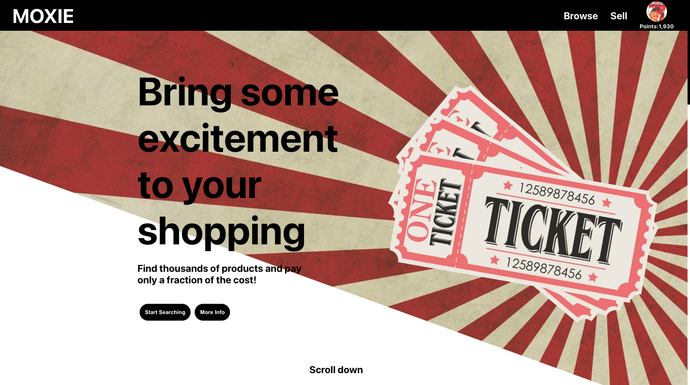
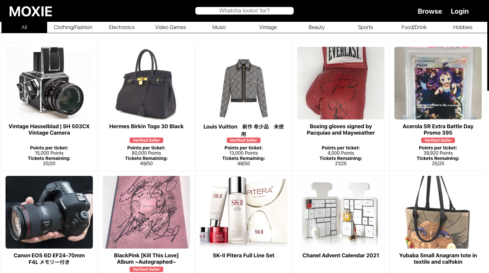

# MOXIE

> MOXIE - Capstone project for Flatiron bootcamp.

## Table of contents

1. [General info](#general)
2. [Project Demo](#project)
3. [Technologies](#technologies)
4. [Features](#features)
5. [To Be Added](#to-be-added)
6. [Contact](#contact)

## General info

- Designed and coded by Hung Le
- Artwork from various magazines and illustrations from 1940s - 1960s magazines

This application is designed to be a concept for a different type of p2p e-commerce business. While most e-commerce business work as a store, this app takes the concept of loot boxes and gacha mechanics in video games and tries to implement it into an e-commerce application. Users can buy tickets using points charged on their accounts in hopes of winning an item. Currently only the winner will receive an item, and others will not receive anything at all, but for future development, all users who buy tickets will win something (digital goods?).

## Project Demo

<kbd>

</kbd>

<kbd>

</kbd>

## Technologies

Tools and libraries used:

### Frontend Development

- React.js - ^17.0.2
- GreenSock (GSAP) - ^3.9.1
- FUSE.JS - ^6.4.6
- Moment.js - 2.29.1

### Backend Development

- Ruby-on-Rails

## Features

Progress of this build for the Front-end:

- Basic CRUD functionality
- Buying tickets and charging points on account will persist and update on all pages
- Search bar will perform a fuzzy search from products' title, category, and keywords all at the same time and return filtered items dynamically using FUSE.JS
- You can only buy tickets if you are logged in and you have enough points and if you are not the seller of said item
- Products on browse page will expand for more information when clicked
- Category selector which will work with the search bar for further filtering
- Landing page animation using GSAP
- Using table association to show seller information and rating on products
- Sell form and login form uses front-end validation along with the back-end validation for increased security
- Accounts stay logged in even if page is refreshed through localStorage (need to get sessions and cookies working instead)
- Account id stored in local storage is encrypted to prevent logging in by editing local storage
- If seller deleted a lited item, points will refund points back to all buyers who hold tickets
- Once all tickets are sold for an item, seller will then receive points (seller should receive points once item is delivered)
- Once all tickets are sold, a random generator will choose 1 ticket as the winner of the product (the more tickets one user holds, the higher the chance of winning)
- Winners of products are able to see seller information (need to implement a message feature)
- Sellers can see the name and address of winner for delivery

## To be added

- Verified sellers title should only be held if seller rating is over 4.5
- Websocket for winner and seller to communicate
- Add "delivered" and "received" before seller's points are added to their account

## Contact

- Name: Hung Le
- GitHub: https://github.com/The-Orange-Dot
- LinkedIn: https://www.linkedin.com/in/hung-le-fullstack/
